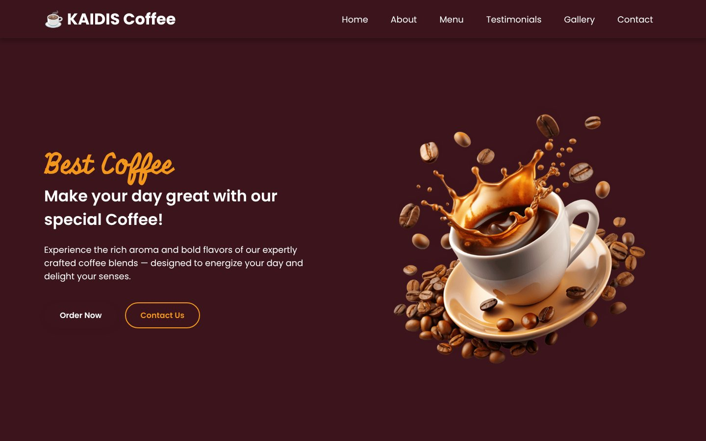
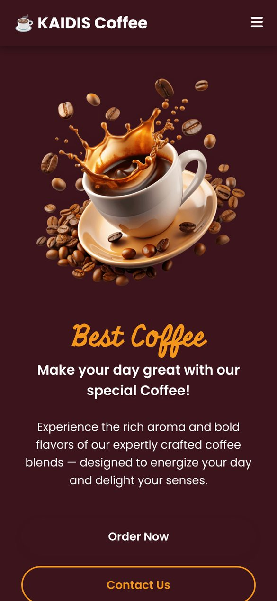
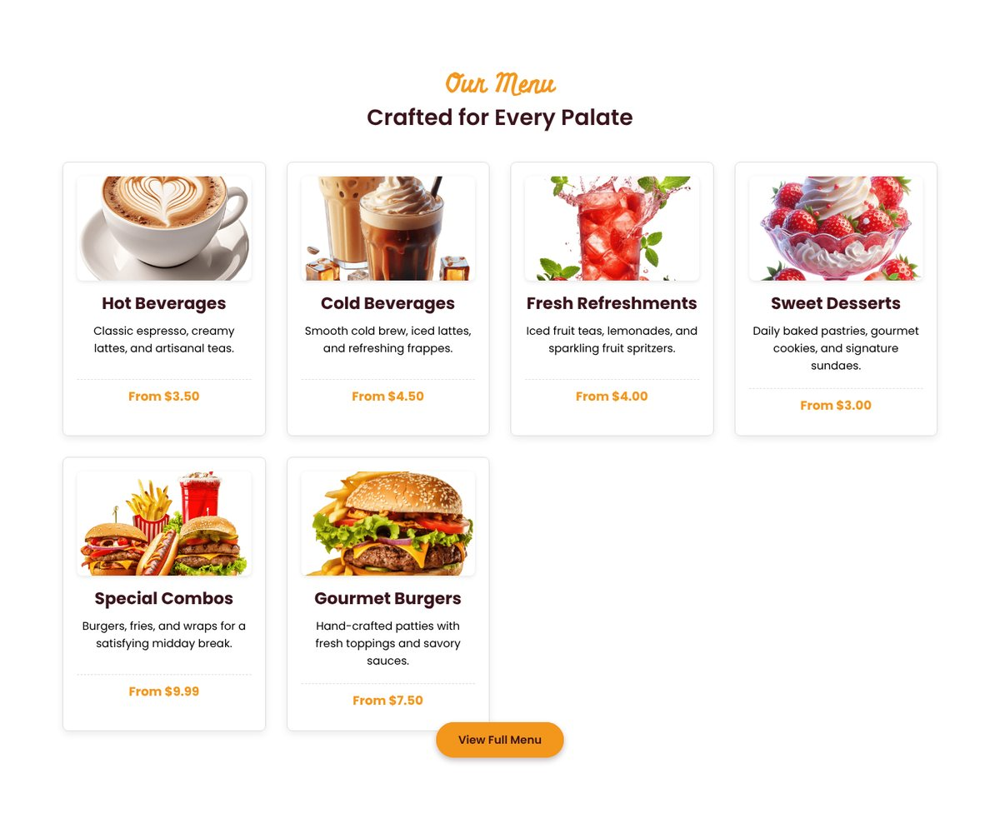
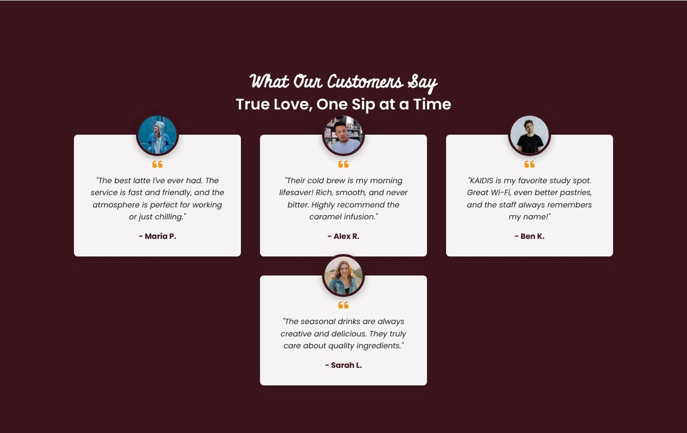
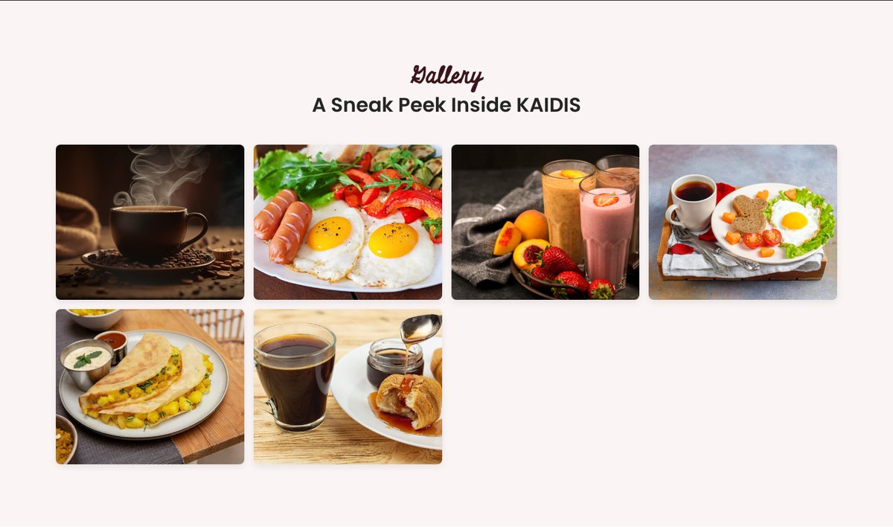

# ☕ KAIDIS Coffee Shop

A modern, fully responsive website for **KAIDIS Coffee**—a premium café showcasing artisanal coffee, fresh pastries, and a welcoming community space.


---

<p align="center">
  
  &nbsp;
  
</p>
<p align="center"><sub>Desktop and mobile views</sub></p>

<p align="center"><a href="https://scarface96.github.io/KAIDIS--Coffee-Shop/"><b>View the live site ↗</b></a></p>

## 🎯 Overview

KAIDIS Coffee is a single-page website designed to attract customers and showcase a premium coffee shop brand. Built with clean, semantic HTML and modern CSS, it provides a smooth user experience across all devices.

### Key Features

✨ **Fully Responsive Design**
- Desktop, tablet, and mobile optimized
- Mobile-first approach with breakpoints at 992px and 768px

🎨 **Modern Aesthetics**
- Deep maroon & warm gold color scheme
- Smooth scrolling navigation
- Interactive hover effects and animations

☕ **Complete Sections**
- Hero banner with call-to-action
- "Our Story" about section
- Menu showcase with 6 product categories
- Customer testimonials
- Photo gallery
- Contact form & business information

📱 **Mobile Menu**
- Hamburger menu toggle for small screens
- Smooth slide-in animation
- Overlay backdrop for better UX

---

## 📁 Project Structure

```
KAIDIS--Coffee-Shop/
├── index.html          # Main HTML file with all sections
├── style.css           # Comprehensive stylesheet (responsive, 750+ lines)
├── script.js           # Mobile menu functionality
├── images/             # Product and gallery images
│   ├── coffee-hero-section.png
│   ├── about-image.jpg
│   ├── hot-beverages.png
│   ├── cold-beverages.png
│   ├── refreshment.png
│   ├── desserts.png
│   ├── special-combo.png
│   ├── burger-frenchfries.png
│   ├── user-1.jpg to user-4.jpg
│   ├── gallery-1.jpg to gallery-6.jpg
│   └── ...
└── README.md           # This file
```

---

## 🚀 Getting Started

### No Build Required
This is a pure HTML/CSS/JavaScript project—no build tools or npm packages needed!

### Option 1: Direct Browser Opening
Simply download or clone the repository and open `index.html` in your browser:
```bash
git clone https://github.com/Scarface96/KAIDIS--Coffee-Shop.git
cd KAIDIS--Coffee-Shop
open index.html  # macOS
# or
start index.html  # Windows
# or
xdg-open index.html  # Linux
```

### Option 2: Local Server (Python 3)
```bash
python -m http.server 8000
# Visit: http://localhost:8000
```

### Option 3: Local Server (Node.js)
```bash
npx http-server
# Visit: http://localhost:8080
```

---

## 🎨 Design System

### Color Palette

| Element | Color | Hex Code |
|---------|-------|----------|
| Primary (Maroon) | Deep burgundy | `#3b141c` |
| Secondary (Gold) | Warm orange | `#f3961c` |
| Light Background | Soft pink | `#faf4f5` |
| Dark Text | Charcoal | `#252525` |
| White | Pure white | `#ffffff` |

### Typography

- **Display Font:** Miniver (section titles)
- **Body Font:** Poppins (400, 500, 600, 700 weights)
- **Source:** Google Fonts

### Spacing & Layout

- Max content width: `1300px`
- Section padding: `100px` (desktop), `80px` (tablet), `60px` (mobile)
- Border radius: `8px` (cards), `30px` (buttons), `50%` (avatars)

---

## 📱 Responsive Breakpoints

| Device | Screen Width | Changes |
|--------|--------------|---------|
| **Desktop** | > 992px | Full navbar, all testimonials visible |
| **Tablet** | 768px – 992px | Stacked layout, 2 testimonials hidden |
| **Mobile** | < 768px | Hamburger menu, single-column layout |
| **Small Phone** | < 480px | Reduced font sizes, vertical button stacking |

---

## 🔧 Key JavaScript Features

### Mobile Menu Toggle
Located in `script.js`, the menu system:
- Toggles the `show-mobile-menu` class on the body
- Slides in a fixed sidebar menu
- Shows a semi-transparent overlay backdrop
- Auto-closes when a navigation link is clicked

```javascript
const toggleMenu = () => {
    document.body.classList.toggle("show-mobile-menu");
};
```

---

## 📋 Page Sections

### 1. **Header & Navigation**
- Fixed navbar with logo and navigation links
- Responsive menu toggle button
- Smooth scroll to sections

### 2. **Hero Section**
- Full-viewport banner with coffee imagery
- Headline and value proposition
- "Order Now" and "Contact Us" CTAs

### 3. **About Section**
- Brand story and values
- Image and descriptive text
- "Visit Us" call-to-action

### 4. **Menu Section**
- 6 product categories with images:
  - Hot Beverages
  - Cold Beverages
  - Fresh Refreshments
  - Sweet Desserts
  - Special Combos
  - Gourmet Burgers
- Price ranges and descriptions
- Card hover effects

### 5. **Testimonials Section**
- 4 customer reviews (2 hidden on mobile)
- Circular avatars positioned above cards
- Quote styling with Font Awesome icons

### 6. **Gallery Section**
- 6 food/beverage photos
- Responsive grid layout
- Hover zoom effect

### 7. **Contact Section**
- Location, phone, email, and hours
- Contact form with validation
- Light pink background card

### 8. **Footer**
- Copyright info
- Social media links (Facebook, Instagram, Twitter)

---

## 🎯 Usage

1. **Navigation:** Click any section link in the navbar to smooth scroll
2. **Mobile Menu:** Tap the hamburger icon (≤768px) to open the menu
3. **Contact Form:** Fill in your details and submit your message
4. **Gallery:** Hover over images to see the zoom effect

---

## 🔗 External Resources

- **Font Awesome Icons:** CDN for hamburger, social, and quote icons
- **Google Fonts:** Poppins and Miniver typefaces
- **Font Awesome CDN:** `https://cdnjs.cloudflare.com/ajax/libs/font-awesome/6.5.1/css/all.min.css`

---

## 💡 Customization

### Change Colors
Edit the CSS variables in `style.css`:
```css
:root {
  --primary-color: #3b141c;    /* Change primary color */
  --secondary-color: #f3961c;  /* Change accent color */
  --light-pink-color: #faf4f5; /* Change light background */
}
```

### Update Business Info
Modify the contact details in the **Contact Section** of `index.html`:
```html
<p><i class="fas fa-map-marker-alt"></i> Your Address Here</p>
<p><i class="fas fa-phone"></i> (555) 123-4567</p>
<p><i class="fas fa-envelope"></i> your-email@example.com</p>
```

### Add Menu Items
Duplicate a menu item card in the **Menu Section** and update:
```html
<div class="menu-item card-style">
  
  <h4>Item Name</h4>
  <p>Description</p>
  <p class="price-text">From $X.XX</p>
</div>
```

---

## 📸 Screenshots

**Menu** — six product categories with hover effects



**Testimonials** — customer reviews with circular avatars



**Gallery** — six food and drink photos



---

## 🎓 Technologies Used

- **HTML5:** Semantic markup, accessibility
- **CSS3:** Flexbox, Grid, Media Queries, CSS Variables, Transitions
- **JavaScript (Vanilla):** DOM manipulation, event listeners
- **Icons:** Font Awesome 6.5.1
- **Fonts:** Google Fonts (Poppins, Miniver)

---

## 🤝 Contributing

Contributions are welcome! To improve the website:

1. Fork the repository
2. Create a feature branch (`git checkout -b feature/amazing-feature`)
3. Commit your changes (`git commit -m 'Add amazing feature'`)
4. Push to the branch (`git push origin feature/amazing-feature`)
5. Open a Pull Request

---

## 📝 License

This project is open source and available under the MIT License. Feel free to use it for your own coffee shop or as a reference for building similar websites.

---

## 📞 Contact & Support

For questions or suggestions about KAIDIS Coffee:
- **Email:** info@kaidiscoffee.com
- **Phone:** (555) 123-4567
- **Address:** 123 Coffee Lane, Central City, CA 90210

**Website Hours:**
- Mon - Fri: 8:00 AM - 6:00 PM
- Sat - Sun: 9:00 AM - 3:00 PM

---

## 🎉 Credits

Built with ❤️ by [Scarface96](https://github.com/Scarface96)

---

**Last Updated:** October 2025
